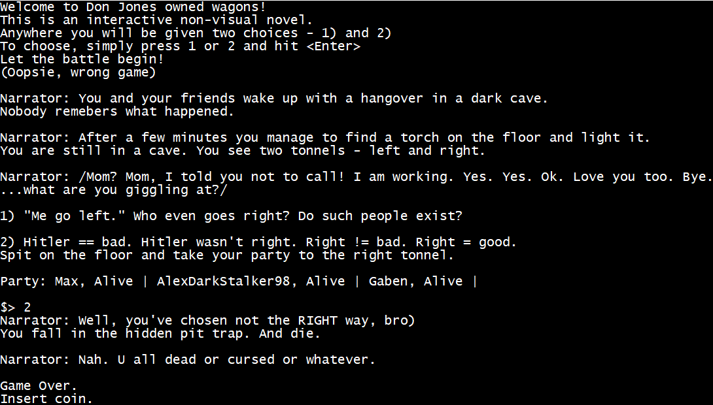

## Interactive novel "Don Jones owned wagons"
This is the first hometask on C# in EPAM External .Net course (fall 2018).
Made solely by me, Maksym Bekuzarov.

## Usage
Just compile the solution and launch it - you will be given two possible ways of moving forward.  
Just choose one of them and enjoy.

## Examples
There are several screenshots in _ExampleScreenshots_ directory

**P.S.** `SceneFactory.LoadSampleStory` method is just an example - in real application the story would be stored in a file or a database and it would be constructed with a visual editor.  
**P.P.S.** Random events are random - so you would probably like to launch the game multiple times.