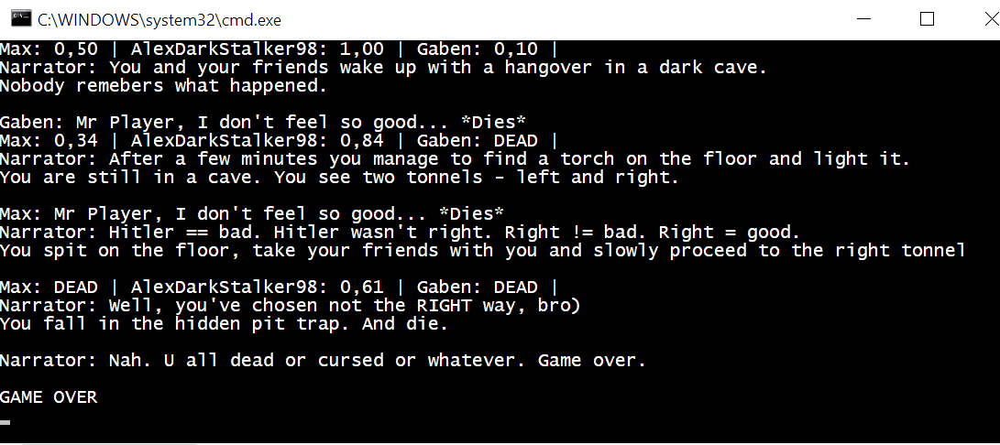

## Self-playing interactive (jk) novel "AI not incuded"
This is the first hometask on C# in EPAM External .Net course (fall 2018).
Made solely by me, Maksym Bekuzarov.

## Usage
Just compile the solution and launch it - the output is different every time.
At least it should be, tweaking those random probabilities is not that easy.

## Examples
There are several screenshots in _ExampleScreenshots_ directory

**P.S.** `SceneFactory.LoadSampleStory` method is just an example - in real application the story would be stored in a file or a database and it would be constructed with a visual editor. 